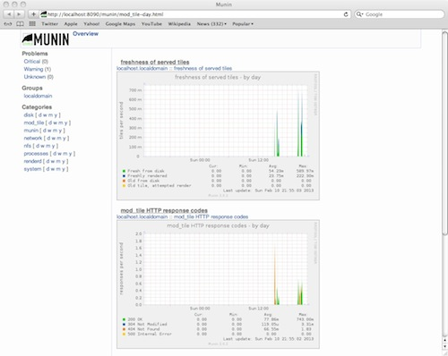

.. _mapnik-toolchain:

****************
Mapnik Toolchain
****************

Hieronder staat de "toolchain" beschreven om OSM RD Tiles te genereren en te serveren volgens
de "Mapnik Toolchain". Dit is de meest standaard OpenStreetMap methode zoals ook gebruikt voor de
tiles beschikbaar op http://openstreetmap.org, a.k.a. "The Slippy Map".

Om in RD-stelsel te werken moet nog iets speciaals gedaan worden.
Zie ook: http://justobjects.org/blog/2010/openstreetmap-tiles-for-dutch-projection-epsg28992 ;-)

Normaal gesproken wordt "mod-tile" met ``renderd`` als tileserver/generator gebruikt.
Echter dan zijn we beperkt tot TMS.
Als variant op de toolchain proberen we ``MapProxy`` via ``MBTiles`` opslag.

We gaan in de volgende stappen te werk:

1. standaard installatie PostGIS/Mapnik/renderd/mod_tile met tiles in EPSG:900913
2. vervang renderd/mod_tile door MapProxy+MBTiles opslag
3. als 2. maar met tiles in EPSG:28992
4. onderzoek: meerdere styles (via TileMill)
5. onderzoek: automatisch updaten
6. heel NL tilen

Installaties
============

Hieronder de stappen voor installatie van de verschillende tools.

Ubuntu
------

We gaan uit van Ubuntu 12.10 64-bits. Deze moet altijd eerst uptodate gebracht worden. ::

	sudo apt-get update
	sudo apt-get upgrade

Repositories
------------

Ubuntu bevat vaak niet laatste versies benodigde packages. Door repositories aan
"Apt" toe te voegen kan wel via standaard packages recente versies geinstalleerd worden.
Allereerst evt tool om repo's toe te voegen (hoeft niet op Ubuntu 12.10). ::

	# install the command add-apt-repository if the command can't be found.
	sudo apt-get install software-properties-common

Dan Kai Krueger's repo (https://launchpad.net/~kakrueger/+archive/openstreetmap Osm2pgsql, Imposm, Osmosis, Mapnik styles etc). ::

	# to add the PPA and update your packaging system.
	sudo add-apt-repository ppa:kakrueger/openstreetmap
	sudo apt-get update

Mapnik repo t.b.v. Mapnik 2.1. Zie https://launchpad.net/~mapnik/+archive/v2.1.0/+packages. ::

	sudo add-apt-repository ppa:mapnik/v2.1.0
	sudo apt-get update

Altijd UbuntuGIS toevoegen https://wiki.ubuntu.com/UbuntuGIS ! ::

	# to add the UbuntuGIS PPA and update your packaging system.
	sudo add-apt-repository ppa:ubuntugis/ubuntugis-unstable
	sudo apt-get update

Check of de repo's goed zijn toegevoegd ::

	ls /etc/apt/sources.list.d
	# geeft
	kakrueger-openstreetmap-quantal.list
	kakrueger-openstreetmap-quantal.list.save
	mapnik-v2_1_0-quantal.list
	ubuntugis-ubuntugis-unstable-quantal.list
	ubuntugis-ubuntugis-unstable-quantal.list.save

Afhankelijkheden
----------------

Eerst afhankelijkheden installeren. ::

     sudo apt-get install libgdal-dev apache2 apt-show-versions

Versies support libs:

- Proj: 4.8.0-3~quantal1
- GDAL: 1.9.2-2~quantal6
- Geos: 3.3.3-1.1

Postgresql/PostGIS
------------------
Belangrijk is om package "postgis" te installeren. Dan komt alles "mee", bijv. Postgres 9.1 etc. ::

    sudo apt-get install postgis postgresql-contrib postgresql-server-dev-9.1

Check of PostGIS v2 is installed. ::

    apt-show-versions | grep postgis
    # moet geven
    postgis/quantal uptodate 2.0.1-2~quantal3
    postgresql-9.1-postgis/quantal uptodate 2.0.1-2~quantal3

Template database aanmaken. Nieuwe manier voor PostGIS 2.0 met EXTENSIONS (ipv PostGIS sql laden)
zie http://postgis.net/docs/manual-2.0/postgis_installation.html#create_new_db_extensions ::

    sudo -u postgres -i
    # aanmaken user "osm" met zelfde password.
    # answer yes for superuser (although this isn't strictly necessary)
    createuser osm
    psql -c "ALTER USER osm WITH PASSWORD 'osm';"
    createdb -E UTF8 -O osm postgis2_template
    psql -d postgis2_template -c "CREATE EXTENSION postgis;"

	# legacy.sql compat layer om problemen met Mapnik 2.0 (niet bestaande functies op te lossen)
    psql -d postgis2_template -f /usr/share/postgresql/9.1/contrib/postgis-2.0/legacy.sql

    # Aanmaken DB met PostGIS template
    createdb -E UTF8 -O osm gis -T postgis2_template

Inloggen enablen. ::

		# Edit the file /etc/postgresql/9.1/main/pg_hba.conf and replace ident by either md5 or trust,
		# depending on whether you want it to ask for a password on your own computer or not.
		# Then reload the configuration file with:

		/etc/init.d/postgresql reload

Handig is phppgadmin. Zie ook http://sql-info.de/postgresql/notes/installing-phppgadmin.html ::

	sudo apt-get install phppgadmin

	# Toelaten inloggen
	sudo emacs /usr/share/phppgadmin/conf/config.inc.php
	$conf['extra_login_security'] = false;

	# dan via localhost /phppgadmin benaderen

OSM2PGSQL
---------

OSM2pgsql wordt gebruikt voor inlezen OSM Planet dump in Postgres.
Zie ook http://wiki.openstreetmap.org/wiki/Osm2pgsql ::

    # install the osm2pgsql package.
    sudo apt-get install osm2pgsql

Installeert: ``osm2pgsql (0.81.0-1~quantal3)``. NB Dit is de juiste versie voor 64-bit ID ondersteuning.
Zie http://web.archiveorange.com/archive/v/wQWIb2eq6T9IKbr4XkWx.

Mapnik
------

Mapnik is voor generatie van tiles. Via eigen repo te installeren. Zelf compileren is verleden tijd! Zie ook
https://github.com/mapnik/mapnik/wiki/UbuntuInstallation en de packages: 
https://launchpad.net/~mapnik/+archive/v2.1.0/+packages (zie boven) ::

      sudo apt-get install libmapnik mapnik-utils python-mapnik

Check installatie (``libmapnik_2.1.0-ubuntu1~quantal2_amd64.deb``) ::

	python
	Python 2.7.3 (default, Sep 26 2012, 21:51:14)
	[GCC 4.7.2] on linux2
	Type "help", "copyright", "credits" or "license" for more information.
	>>> import mapnik
	>>>

mod_tile+renderd
----------------

Vanuit repo install. Dit installeert/activeert mod_tile en renderd. ::

       sudo apt-get install  libapache2-mod-tile

Dit download ook automatisch ``/usr/share/mapnik-osm-data/world_boundaries-spherical.tgz`` (50MB) en
``/usr/share/mapnik-osm-data/processed_p.tar.bz2`` (500MB) en
``/usr/share/mapnik-osm-data/shoreline_300.tar.bz2`` (40MB). Output. ::

Notes:

* Output van apt-get bewaard, zie `<_static/output-apt-get-mod-tile.txt>`_
* Toch even checken want hier wordt ook Mapnik (2.0) installed, terwijl we 2.1 hadden via apt-get !

NB bovenstaande wordt dus MBTiles+MapProxy!!

Data
====

Het laden van de data. Gebied Amsterdam. Zie http://metro.teczno.com/#amsterdam

.. figure:: _static/amsterdam-osm-extent.jpg
   :align: center

   *Figuur MT-1 - Amsterdam Extent (bron: http://metro.teczno.com/#amsterdam)*

Data ophalen. ::

	mkdir /opt/openbasiskaart/data

	# PBF download (53 MB)
	wget http://osm-metro-extracts.s3.amazonaws.com/amsterdam.osm.pbf

	# Coastline A'dam area download (is leeg, dus niet gebruiken!!)
	# wget http://osm-metro-extracts.s3.amazonaws.com/amsterdam.coastline.zip

Data laden in PostgreSQL.  ::

	cd /opt/openbasiskaart/data

	# Op locale VirtualBox VM met weinig geheugen
	# met "--cache-strategy sparse"
	osm2pgsql -W -U osm -d gis --slim --cache-strategy sparse  amsterdam.osm.pbf

	# duurt plm 900 sec op VM

Services
========

Mapnik en mod_tile/renderd met eigen configuratie.

De config van ``renderd`` in /etc/renderd.conf, is voorlopig Mapnik 2.0, maar mogelijk later proberen met Mapnik 2.1 ::

	[renderd]
	stats_file=/var/run/renderd/renderd.stats
	socketname=/var/run/renderd/renderd.sock
	num_threads=4
	tile_dir=/var/lib/mod_tile

	[mapnik]
	plugins_dir=/usr/lib/mapnik/2.0/input
	font_dir=/usr/share/fonts/truetype/ttf-dejavu
	font_dir_recurse=false

	[default]
	URI=/osm/
	XML=/opt/openbasiskaart/mapnik/default/osm.xml
	DESCRIPTION=This is the standard osm mapnik style
	;ATTRIBUTION=&copy;<a href=\"http://www.openstreetmap.org/\">OpenStreetMap</a> and <a href=\"http://wiki.openstreetmap.org/w\
	iki/Contributors\">contributors</a>, <a href=\"http://creativecommons.org/licenses/by-sa/2.0/\">CC-BY-SA</a>
	;HOST=tile.openstreetmap.org
	;SERVER_ALIAS=http://a.tile.openstreetmap.org
	;SERVER_ALIAS=http://b.tile.openstreetmap.org
	;HTCPHOST=proxy.openstreetmap.org

Configureren Renderd/Mapnik/mod_tile. ::

	# Maak kopie default mapnik config
	mkdir /opt/openbasiskaart/mapnik
	cp -r  /etc/mapnik-osm-data /opt/openbasiskaart/mapnik/default
	cd /opt/openbasiskaart/mapnik/default

	# zet user/password naar osm/osm in
	e inc/datasource-settings.xml.inc

	<Parameter name="type">postgis</Parameter>
	<Parameter name="password">osm</Parameter>
	<Parameter name="host">localhost</Parameter>
	<Parameter name="user">osm</Parameter>
	<Parameter name="dbname">gis</Parameter>
	<!-- this should be 'false' if you are manually providing the 'extent' -->
	<Parameter name="estimate_extent">false</Parameter>
	<!-- manually provided extent in epsg 900913 for whole globe -->
	<!-- providing this speeds up Mapnik database queries -->
	<!-- <Parameter name="extent">4.88,52.36,4.90,52.38</Parameter> -->
	<Parameter name="extent">543239.115,6865481.657,545465.505,6869128.129</Parameter>

	# herstarten en log volgen renderd
	tail -f /var/log/syslog |grep renderd &
	/etc/init.d/renderd restart

Notes:

* Mapnik 2.0 met PosGIS 2.0: legacy.sql laden in PostGIS DB
    - ``psql -d gis -f /usr/share/postgresql/9.1/contrib/postgis-2.0/legacy.sql``
* extent
	- moet in EPSG:900913
	- extent gezet op klein stukje A'dam C voor testen
* tiles verwijderen/opschonen
    - ``rm -rf /var/lib/mod_tile/default``
    - ``touch /var/lib/mod_tile/planet-import-complete``
* herstarten renderd: ``/etc/init.d/renderd restart``

Monitoring
==========

Munin is een flexibele monitoring tool, zie: http://munin-monitoring.org.

Installeren. ::

     sudo apt-get install munin-node munin

Enablen voor andere hosts via ``/etc/apache2/conf.d/munin``.

Via browser raadplegen, zie:

   *Figuur MT-2 - Munin in actie*

Verder loggen/volgen:

* PostgreSQL debug output zetten: ``/etc/postgresql/9.1/main/postgresql.conf``, zet ``client_min_messages = log``
* volgen renderd logfile: ``tail -f /var/log/syslog |grep renderd &``
* volgen postgresql log: ``tail -f /var/log/postgresql/postgresql-9.1-main.log &``
* losse tile: http://localhost:8090/osm/17/67318/43072.png

Demo
====

Een demo app staat onder ``/var/www/osm/slippymap.html``. Hier HTML aanpassen om centrum op Amsterdam te zetten.
Evt port zetten indien port forwarding naar local VM (8090 bijv). Dan zetten. ::

	var newLayer = new OpenLayers.Layer.OSM("Local Tiles",
	          "http://localhost:8090/osm/${z}/${x}/${y}.png", {numZoomLevels: 19});

Het resultaat met wat logging info hieronder.

.. figure:: _static/renderd-working2.jpg
   :align: center

   *Figuur MT-3 - Amsterdam-C Extent met renderd+PostgreSQL logging*

Tiles in EPSG:28992
===================

Dit betreft Stap 2. Totnutoe is een standaard Mapnik/mod_tile toolchain opgezet. We moeten een aantal zaken wijzigen
om hetzelfde voor EPSG:28992 tiles te realiseren. Dit is al eerder beschreven in
http://justobjects.org/blog/2010/openstreetmap-tiles-for-dutch-projection-epsg28992. We proberen data
in EPSG:28992 te laden.

Data
----

We nemen eerst een klein stukje planet-data (488kb) rond de Nieuwmarkt in Amsterdam (file:  nieuwmarkt.osm).

Stappen ::

	# DB aanmaken
	createdb -E UTF8 -O osm gis28992 -T postgis2_template

	# Data laden
	osm2pgsql -W -U osm -d gis28992 -E EPSG:28992 --slim --cache-strategy sparse  amsterdam.osm.pbf
	# DIT WERKT NIET: DE DATA WORDT GELADEN IN EPSG:4326

	# data laden als EPSG:4326 (WGS84)
	osm2pgsql -c -W -U osm -d gis28992 -E EPSG:4326 --slim --cache-strategy sparse  nieuwmarkt.osm

MapProxy
--------

Deze stappen voor basis Mapproxy install en de demo app via mod_wsgi in Apache. Vervolgens MapProxy koppelen aan de bestaande Mapnik config. ::

Basis Installatie
~~~~~~~~~~~~~~~~~

Deze stappen voor MapProxy 1.5.0 ::

	# MapProxy Install 1.5.0
	# Python Pip
	sudo apt-get install python-pip

	# Deps
	sudo apt-get install python-imaging python-yaml libproj0
	sudo apt-get install  libgeos-dev python-lxml libgdal-dev python-shapely
	sudo apt-get install  build-essential python-dev libjpeg-dev zlib1g-dev libfreetype6-dev
	sudo pip install https://bitbucket.org/olt/pil-2009-raclette/get/default.tar.gz
	sudo apt-get install  python-yaml

	# MapProxy
	sudo pip install MapProxy

	# Check install
	mapproxy-util --version

mod_wsgi Koppelen
~~~~~~~~~~~~~~~~~

mod_wsgi is een van de vele manieren om MapProxy aan te roepen. Hier direct in Apache via mod_wsgi.
We draaien hier gelijk de standaard demo app van MapProxy. ::

	# mod_wsgi install
	apt-get install libapache2-mod-wsgi

	# create basis wsgi config for demo app
	mdkir /opt/openbasiskaart/mapproxy/demo
	cd /opt/openbasiskaart/mapproxy/demo

	# create basis mapproxy config
	# maakt  mapproxy.yaml  en seed.yaml aan
	mapproxy-util create -t base-config ./

	# maak WSGI Python webapp (config.py) voor deze config (mapproxy.yaml)
	mapproxy-util create -t wsgi-app -f mapproxy.yaml config.py

	# maak webserver config waarin mapproxy webapp gemapped:

	# deze file aanmaken in /etc/apache2/sites-available/mapproxy
	<VirtualHost *:80>
		WSGIScriptAlias /mpdemo /opt/openbasiskaart/mapproxy/demo/config.py/

		<Directory /opt/openbasiskaart/mapproxy/demo>
		  Order deny,allow
		  Allow from all
		</Directory>

		ErrorLog ${APACHE_LOG_DIR}/mapproxy-error.log

		# Possible values include: debug, info, notice, warn, error, crit,
		# alert, emerg.
		LogLevel debug

		CustomLog ${APACHE_LOG_DIR}/mapproxy-access.log combined
	</VirtualHost>

	# aanmaken site voor apache
	a2site mapproxy
	apache2ctl restart

	# cache directory moet schrijfbaar zijn!!
	# voorlopig zo
	mkdir /opt/openbasiskaart/mapproxy/demo/cache_dir
	chmod 777 /opt/openbasiskaart/mapproxy/demo/cache_dir

    # met browser naar http://localhost/mpdemo OK

Mapnik als Bron
~~~~~~~~~~~~~~~

Problemen ::

	sudo pip install nik2img
	nik2img.py osm.xml mapasd.png -f png256 -b 4.897 52.370 4.898 52.371
	# geeft goede map

	# test tile
	http://localhost:8090/mpdemo/tms/1.0.0/mapnik_default_layer_EPSG900913/15/33659/43999.png

    # hmm /usr/share/proj/epsg file toch niet op orde, deze toevoegen
    <900913> +proj=merc +a=6378137 +b=6378137 +lat_ts=0.0 +lon_0=0.0 +x_0=0.0 +y_0=0 +k=1.0 +units=m +nadgrids=@null +no_defs +over<>

Default mapproxy.yaml met eigen OSM. ::

	services:
	  demo:
	  kml:
	  tms:
		# needs no arguments
	  wmts:
	  wms:
		# srs: ['EPSG:4326', 'EPSG:900913']
		# image_formats: ['image/jpeg', 'image/png']
		md:
		  # metadata used in capabilities documents
		  title: MapProxy WMS Proxy
		  abstract: This is the fantastic MapProxy.
		  online_resource: http://mapproxy.org/
		  contact:
			person: Your Name Here
			position: Technical Director
			organization:
			address: Fakestreet 123
			city: Somewhere
			postcode: 12345
			country: Germany
			phone: +49(0)000-000000-0
			fax: +49(0)000-000000-0
			email: info@omniscale.de
		  access_constraints:
			This service is intended for private and evaluation use only.
			The data is licensed as Creative Commons Attribution-Share Alike 2.0
			(http://creativecommons.org/licenses/by-sa/2.0/)
		  fees: 'None'

	layers:
	  - name: osm
		title: Omniscale OSM WMS - osm.omniscale.net
		sources: [osm_cache]
	  - name: mapnik_default_layer
		title: Mapnik Default
		sources: [mapnik_default_cache]

	caches:
	  osm_cache:
		grids: [GLOBAL_MERCATOR, global_geodetic_sqrt2]
		sources: [osm_wms]

	  mapnik_default_cache:
		grids: [GLOBAL_MERCATOR]
		sources: [default_mapnik]

	sources:
	  osm_wms:
		type: wms
		req:
		  url: http://osm.omniscale.net/proxy/service?
		  layers: osm

	  default_mapnik:
		type: mapnik
		mapfile: /opt/openbasiskaart/mapnik/default/osm.xml
		use_mapnik2: true
		coverage:
	#      bbox: [4.88,52.36,4.90,52.38]
		  bbox: [543239.115,6865481.657,545465.505,6869128.129]
		  srs: 'EPSG:900913'

	grids:
	  global_geodetic_sqrt2:
		base: GLOBAL_GEODETIC
		res_factor: 'sqrt2'

	globals:
	  # # cache options
	  cache:
		# where to store the cached images
		base_dir: './cache_data'
		# where to store lockfiles
		lock_dir: './cache_data/locks'

	  # image/transformation options
	  image:
		  resampling_method: nearest

seed.yaml ::

	seeds:
	  myseed1:
		caches: [osm_cache]
		grids: [GLOBAL_MERCATOR]
		coverages: [austria]
		levels:
		  to: 10
		refresh_before:
		  time: 2010-10-21T12:35:00

	  mapnik_default_seed:
		caches: [mapnik_default_cache]
		grids: [GLOBAL_MERCATOR]
		coverages: [mapnik_default_coverage]
		levels:
		  to: 15
		refresh_before:
		  time: 2010-10-21T12:35:00

	cleanups:
	  clean1:
		caches: [osm_cache]
		grids: [GLOBAL_MERCATOR]
		remove_before:
		  days: 7
		  hours: 3
		levels: [2,3,5,7]

	coverages:
	  austria:
		bbox: [9.36, 46.33, 17.28, 49.09]
		bbox_srs: "EPSG:4326"
	  mapnik_default_coverage:
		bbox: [543239.115,6865481.657,545465.505,6869128.129]
		bbox_srs: "EPSG:900913"

MapProxy met Mapnik2 lijkt moeizaam vanuit TMS, wel als we eerst seeden. ::

	mapproxy-seed  -f mapproxy.yaml -c 4 seed.yaml --seed=mapnik_default_seed

Uiteindelijk resultaat.

.. figure:: _static/mapnik-met-mapproxy.jpg
   :align: center

   *Figuur MT-4 - Eerste resultaat Mapnik met Mapproxy (900913+file cache)*

MBTiles Cache
~~~~~~~~~~~~~

SQLite3 installatie. http://www.sqlite.org ::

	sudo apt-get install sqlite3 libsqlite3-dev

Nieuwe Layer en Cache toevoegen in maproxy.yaml ::

	.
	.
	layers:
	  - name: osm
		title: Omniscale OSM WMS - osm.omniscale.net
		sources: [osm_cache]
	  - name: mapnik_default_layer
		title: MapnikDefault
		sources: [mapnik_default_cache]
	  - name: mapnik_mbtiles_default_layer
		title: MapnikMBTilesDefault
		sources: [mapnik_mbtiles_default_cache]
	.
	.
	caches:
	  osm_cache:
		grids: [GLOBAL_MERCATOR, global_geodetic_sqrt2]
		sources: [osm_wms]

	  mapnik_default_cache:
		sources: [default_mapnik]
		grids: [GLOBAL_MERCATOR]

	  mapnik_mbtiles_default_cache:
		sources: [default_mapnik]
		grids: [GLOBAL_MERCATOR]
		cache:
		  type: mbtiles
		  filename: mapnik_default.mbtiles

Seeden voor MBTiles cache. ::

	sudo mapproxy-seed  -f mapproxy.yaml -c 1 seed.yaml --seed=mapnik_mbtiles_default_seed

Notes:

	- only one worker/thread ``-c 1``.If larger than 1 gives error: ``"OperationalError: database is locked"``
	- only seeding works, not via TMS

Error wanneer expliciet tilen via TMS. ::

	2013-02-15 16:33:07,061 - CRITICAL - mapproxy.wsgiapp - fatal error in tms for /tms/1.0.0/mapnik_mbtiles_default_layer_EPSG900913/17/134637/175982.png
	Traceback (most recent call last):
	  File "/usr/local/lib/python2.7/dist-packages/mapproxy/wsgiapp.py", line 166, in __call__
		resp = self.handlers[handler_name].handle(req)
	  File "/usr/local/lib/python2.7/dist-packages/mapproxy/service/base.py", line 30, in handle
		return handler(parsed_req)
	  File "/usr/local/lib/python2.7/dist-packages/mapproxy/service/tile.py", line 74, in map
		tile = layer.render(tile_request, use_profiles=tile_request.use_profiles, coverage=limit_to)
	  File "/usr/local/lib/python2.7/dist-packages/mapproxy/service/tile.py", line 265, in render
		tile = self.tile_manager.load_tile_coord(tile_coord, with_metadata=True)
	  File "/usr/local/lib/python2.7/dist-packages/mapproxy/cache/tile.py", line 105, in load_tile_coord
		created_tiles = creator.create_tiles([tile])
	  File "/usr/local/lib/python2.7/dist-packages/mapproxy/cache/tile.py", line 227, in create_tiles
		created_tiles = self._create_meta_tiles(meta_tiles)
	  File "/usr/local/lib/python2.7/dist-packages/mapproxy/cache/tile.py", line 300, in _create_meta_tiles
		created_tiles.extend(self._create_meta_tile(meta_tile))
	  File "/usr/local/lib/python2.7/dist-packages/mapproxy/cache/tile.py", line 307, in _create_meta_tile
		with self.tile_mgr.lock(main_tile):
	  File "/usr/local/lib/python2.7/dist-packages/mapproxy/platform/cpython/lock.py", line 42, in __enter__
		self.lock()
	  File "/usr/local/lib/python2.7/dist-packages/mapproxy/platform/cpython/lock.py", line 72, in lock
		raise LockTimeout('another process is still running with our lock')
	LockTimeout: another process is still running with our lock

Seeding en Cleanup (remove) voor default MBTiles cache. seed.yaml ::

	seeds:
	.
	.
	  mapnik_mbtiles_default_seed:
		caches: [mapnik_mbtiles_default_cache]
		grids: [GLOBAL_MERCATOR]
		coverages: [mapnik_default_coverage]
		levels:
		  to: 17
	.
	.
	cleanups:
	  clean1:
	    caches: [osm_cache]
	    grids: [GLOBAL_MERCATOR]
	    remove_before:
	    days: 7
	    hours: 3
	    levels: [2,3,5,7]

	  clean_mapnik_mbtiles_default:
	    caches: [mapnik_mbtiles_default_cache]
	    grids: [GLOBAL_MERCATOR]
	    levels: [2,3,5,7]

Commando voor cleanup. ::

	sudo mapproxy-seed  -f mapproxy.yaml -c 1 seed.yaml --cleanup=clean_mapnik_mbtiles_default

Util ``sqlite3`` command line om database te beheren. ::

	sudo sqlite3  cache_data/mapnik_default.mbtiles
	SQLite version 3.7.13 2012-06-11 02:05:22
	Enter ".help" for instructions
	Enter SQL statements terminated with a ";"
	sqlite>  select * from sqlite_master;
	table|tiles|tiles|2|CREATE TABLE tiles (
					zoom_level integer,
					tile_column integer,
					tile_row integer,
					tile_data blob)
	table|metadata|metadata|3|CREATE TABLE metadata (name text, value text)
	index|idx_tile|tiles|4|CREATE UNIQUE INDEX idx_tile on tiles
					(zoom_level, tile_column, tile_row)
	sqlite>  select * from tiles;
	sqlite>  select * from metadata;

