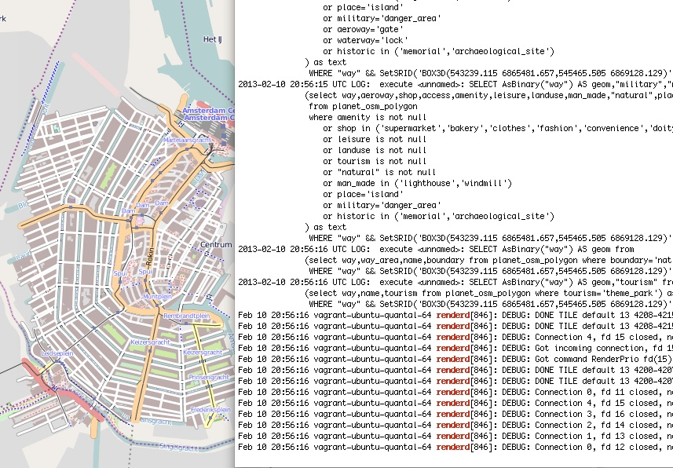

.. _mapnik-toolchain:

****************
Mapnik Toolchain
****************

Hieronder staat de "toolchain" beschreven om OSM RD Tiles te genereren en te serveren volgens
de "Mapnik Toolchain". Dit is de meest standaard OpenStreetMap methode zoals ook gebruikt voor de
tiles beschikbaar op http://openstreetmap.org, a.k.a. "The Slippy Map".

Om in RD-stelsel te werken moet nog iets speciaals gedaan worden.
Zie ook: http://justobjects.org/blog/2010/openstreetmap-tiles-for-dutch-projection-epsg28992 ;-)

Normaal gesproken wordt "mod-tile" met ``renderd`` als tileserver/generator gebruikt.
Echter dan zijn we beperkt tot TMS.
Als variant op de toolchain proberen we ``MapProxy`` via ``MBTiles`` opslag.

We gaan in de volgende stappen te werk:

1. standaard installatie PostGIS/Mapnik/renderd/mod_tile met tiles in EPSG:900913
2. idem maar met tiles in EPSG:28992
3. vervang renderd/mod_tile door MapProxy+MBTiles
4. onderzoek: meerdere styles (via TileMill)
5. onderzoek: automatisch updaten
6. heel NL tilen

Installaties
============

Hieronder de stappen voor installatie van de verschillende tools.

Ubuntu
------

We gaan uit van Ubuntu 12.10 64-bits. Deze moet altijd eerst uptodate gebracht worden. ::

	sudo apt-get update
	sudo apt-get upgrade

Repositories
------------

Ubuntu bevat vaak niet laatste versies benodigde packages. Door repositories aan
"Apt" toe te voegen kan wel via standaard packages recente versies geinstalleerd worden.
Allereerst evt tool om repo's toe te voegen (hoeft niet op Ubuntu 12.10). ::

	# install the command add-apt-repository if the command can't be found.
	sudo apt-get install software-properties-common

Dan Kai Krueger's repo (https://launchpad.net/~kakrueger/+archive/openstreetmap Osm2pgsql, Imposm, Osmosis, Mapnik styles etc). ::

	# to add the PPA and update your packaging system.
	sudo add-apt-repository ppa:kakrueger/openstreetmap
	sudo apt-get update

Altijd UbuntuGIS toevoegen https://wiki.ubuntu.com/UbuntuGIS ! ::

	# to add the UbuntuGIS PPA and update your packaging system.
        sudo add-apt-repository ppa:ubuntugis/ubuntugis-unstable
	sudo apt-get update

Check of de repo's goed zijn toegevoegd. ::

       ls /etc/apt/sources.list.d
       # geeft
       kakrueger-openstreetmap-quantal.list  kakrueger-openstreetmap-quantal.list.save  ubuntugis-ubuntugis-unstable-quantal.list

Afhankelijkheden
----------------

Eerst afhankelijkheden installeren. ::

     sudo apt-get install libgdal-dev apache2 apt-show-versions

Proj: 4.8.0-3~quantal1

GDAL: 1.9.2-2~quantal6

Geos: 3.3.3-1.1

Postgresql/PostGIS
------------------
Belangrijk is om package "postgis" te installeren. Dan komt alles "mee", bijv. Postgres 9.1 etc. ::

    sudo apt-get install postgis postgresql-contrib postgresql-server-dev-9.1

Check of PostGIS v2 is installed. ::

    apt-show-versions | grep postgis
    # moet geven
    postgis/quantal uptodate 2.0.1-2~quantal3
    postgresql-9.1-postgis/quantal uptodate 2.0.1-2~quantal3

Template database aanmaken. Nieuwe manier voor PostGIS 2.0 met EXTENSIONS (ipv PostGIS sql laden)
zie http://postgis.net/docs/manual-2.0/postgis_installation.html#create_new_db_extensions ::

    sudo -u postgres -i
    # aanmaken user "osm" met zelfde password.
    # answer yes for superuser (although this isn't strictly necessary)
    createuser osm
    psql -c "ALTER USER osm WITH PASSWORD 'osm';"
    createdb -E UTF8 -O osm postgis2_template
    psql -d postgis2_template -c "CREATE EXTENSION postgis;"
    createdb -E UTF8 -O osm gis -T postgis2_template

	# legacy.sql compat layer om problemen met Mapnik 2.0 (niet bestaande functies op te lossen)
	psql -d gis -f /usr/share/postgresql/9.1/contrib/postgis-2.0/legacy.sql

Inloggen enablen. ::

		# Edit the file /etc/postgresql/9.1/main/pg_hba.conf and replace ident by either md5 or trust,
		# depending on whether you want it to ask for a password on your own computer or not.
		# Then reload the configuration file with:

		/etc/init.d/postgresql reload

Handig is phppgadmin. Zie ook http://sql-info.de/postgresql/notes/installing-phppgadmin.html ::

	sudo apt-get install phppgadmin

	# Toelaten inloggen
	sudo emacs /usr/share/phppgadmin/conf/config.inc.php
	$conf['extra_login_security'] = false;

	# dan via localhost /phppgadmin benaderen

OSM2PGSQL
---------

OSM2pgsql wordt gebruikt voor inlezen OSM Planet dump in Postgres.
Zie ook http://wiki.openstreetmap.org/wiki/Osm2pgsql ::

    # install the osm2pgsql package.
    sudo apt-get install osm2pgsql

Installeert: ``osm2pgsql (0.81.0-1~quantal3)``. NB Dit is de juiste versie voor 64-bit ID ondersteuning.
Zie http://web.archiveorange.com/archive/v/wQWIb2eq6T9IKbr4XkWx.

Mapnik
------

Mapnik is voor generatie van tiles. Via eigen repo te installeren. Zelf compileren is verleden tijd! Zie ook
https://github.com/mapnik/mapnik/wiki/UbuntuInstallation en de packages: 
https://launchpad.net/~mapnik/+archive/v2.1.0/+packages ::

      sudo add-apt-repository ppa:mapnik/v2.1.0
      sudo apt-get update
      sudo apt-get install libmapnik mapnik-utils python-mapnik

Check installatie (``libmapnik_2.1.0-ubuntu1~quantal2_amd64.deb``) ::

	python
	Python 2.7.3 (default, Sep 26 2012, 21:51:14)
	[GCC 4.7.2] on linux2
	Type "help", "copyright", "credits" or "license" for more information.
	>>> import mapnik
	>>>

mod_tile+renderd
----------------

Vanuit repo install. Dit installeert/activeert mod_tile en renderd. ::

       sudo apt-get install  libapache2-mod-tile

Dit download ook automatisch ``/usr/share/mapnik-osm-data/world_boundaries-spherical.tgz`` (50MB) en
``/usr/share/mapnik-osm-data/processed_p.tar.bz2`` (500MB) en
``/usr/share/mapnik-osm-data/shoreline_300.tar.bz2`` (40MB). Output. ::

Notes:

* Output van apt-get bewaard, zie `<_static/output-apt-get-mod-tile.txt>`_
* Toch even checken want hier wordt ook Mapnik (2.0) installed, terwijl we 2.1 hadden via apt-get !

NB bovenstaande wordt dus MBTiles+MapProxy!!

Data
====

Het laden van de data. Gebied Amsterdam. Zie http://metro.teczno.com/#amsterdam

.. figure:: _static/amsterdam-osm-extent.jpg
   :align: center

   *Figuur MT-1 - Amsterdam Extent (bron: http://metro.teczno.com/#amsterdam)*

Data ophalen. ::

	mkdir /opt/openbasiskaart/data

	# PBF download (53 MB)
	wget http://osm-metro-extracts.s3.amazonaws.com/amsterdam.osm.pbf

	# Coastline A'dam area download (53 MB)
	wget http://osm-metro-extracts.s3.amazonaws.com/amsterdam.coastline.zip

Data laden in PostgreSQL.  ::

	cd /opt/openbasiskaart/data

	# Op locale VirtualBox VM met weinig geheugen
	# met "--cache-strategy sparse"
	osm2pgsql -W -U osm -d gis --slim --cache-strategy sparse  amsterdam.osm.pbf

	# duurt plm 900 sec op VM

Services
========

Configureren Renderd/Mapnik/mod_tile. ::

	# Maak kopie default mapnik config
	mkdir /opt/openbasiskaart/mapnik
	cp -r  /etc/mapnik-osm-data /opt/openbasiskaart/mapnik/default
	cd /opt/openbasiskaart/mapnik/default

	# zet user/password naar osm/osm in
	e inc/datasource-settings.xml.inc

	<Parameter name="type">postgis</Parameter>
	<Parameter name="password">osm</Parameter>
	<Parameter name="host">localhost</Parameter>
	<Parameter name="user">osm</Parameter>
	<Parameter name="dbname">gis</Parameter>
	<!-- this should be 'false' if you are manually providing the 'extent' -->
	<Parameter name="estimate_extent">false</Parameter>
	<!-- manually provided extent in epsg 900913 for whole globe -->
	<!-- providing this speeds up Mapnik database queries -->
	<!-- <Parameter name="extent">4.88,52.36,4.90,52.38</Parameter> -->
	<Parameter name="extent">543239.115,6865481.657,545465.505,6869128.129</Parameter>

	# herstarten en log volgen renderd
	tail -f /var/log/syslog |grep renderd &
	/etc/init.d/renderd restart

Notes:

* Mapnik 2.0 met PosGIS 2.0: legacy.sql laden in PostGIS DB
    - ``psql -d gis -f /usr/share/postgresql/9.1/contrib/postgis-2.0/legacy.sql``
* extent
	- moet in EPSG:900913
	- extent gezet op klein stukje A'dam C voor testen
* tiles verwijderen/opschonen
    - ``rm -rf /var/lib/mod_tile/default``
    - ``touch /var/lib/mod_tile/planet-import-complete``
* herstarten renderd: ``/etc/init.d/renderd restart``
* PostgreSQL debug output zetten: ``/etc/postgresql/9.1/main/postgresql.conf``, zet ``client_min_messages = log``
* volgen renderd logfile: ``tail -f /var/log/syslog |grep renderd &``
* volgen postgresql log: ``tail -f /var/log/postgresql/postgresql-9.1-main.log &``

Demo
====

Een demo app staat onder ``/var/www/osm/slippymap.html``. Hier HTML aanpassen om centrum op Amsterdam te zetten.
Evt port zetten indien port forwarding naar local VM (8090 bijv). Dan zetten. ::

	var newLayer = new OpenLayers.Layer.OSM("Local Tiles",
	          "http://localhost:8090/osm/${z}/${x}/${y}.png", {numZoomLevels: 19});

Het resultaat met wat logging info hieronder.

   *Figuur MT-2 - Amsterdam-C Extent met renderd+PostgreSQL logging*

